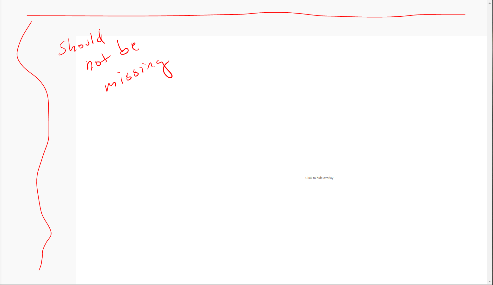

#### YouTube

08/08/2020

Ahh... so there's multiple `id="primary"` on a page how nice.
Also no pop state, it seems to be "reacty" eg. soft urls/routing
hmm.... hoping can select stuff by their custom tags/custom attributes

08/08/2020

So... this is problematic. So far the best thing I've found is to inject CSS that runs right away/override the primary tiles(hide them). You'll see the blank tile placeholders briefly but does the job of not hijacking your intent/mind by showing you a bunch of eye-catching stuff.

Currently struggling with trying to run scripts on certain paths eg. this CSS override should only work on the home page. And I still need to add some way to re-enable/see the primary tiles on home page if I want.

I've seen that modifying the body seems to break the page/makes it just not work.

z-index looks better vs. using display none

I don't know... maybe it's not possible to inject custom HTML because the YouTube JS knows its been modified so it breaks. See example below where I try to append some html to the end of the body html.

I just wanted some visual way to remind me "click anywhere" to show the primary tiles.

But... this works for now, it accomplishes the main goal of hiding the intro tiles so I'm not distracted and I can still enable them again by clicking anywhere.



This is the code I ran for that

```window.onload = () => {
    document.body.addEventListener('click', function() {
        document.getElementById('primary').classList.add('override-z-index');
    });

    let primaryLoadedInterval;
    let primary = null;

    primaryLoadedInterval = setInterval(() => {
        if (!primary) {
            primary = document.getElementById('primary');
            document.body.innerHTML += customOverlay;
        } else {
            clearInterval(primaryLoadedInterval);
        }
    }, 150);
};
```