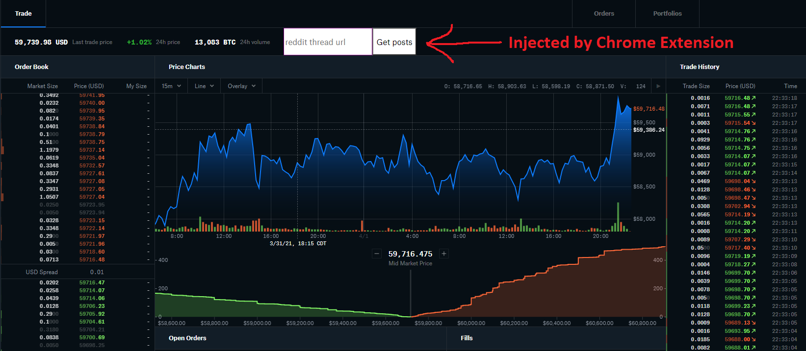

### About

This is a Chrome extension that can inject Reddit posts into Coinbase Pro if for some reason you wanted to do that.

A single request is performed at a time, say # of posts * 5 seconds or however long your delay is. So there shouldn't be any rate problems. When the cycling is done it will recall the url unless you refresh the page and add a new url.

You can paste a Reddit thread into here and it should get all the posts for you and then the rest of the code will cycle through the posts one at a time.

See it working below

### To use
Aside from as mentioned needing your own Node API running the `basic-node-reddit-getter-api.js` you should be able to just clone this and load it as an unpackaged extension in your Chrome browser. You'll have to update the API url at the top of `cbp-reddit.js` to your url but yeah.
### Disclaimers

Note that some websites will break if you modify the DOM. I saw YouTube does that but CBP thankfully does not at this time.

I also did not spend much time styling or anything but you can make it prettier.