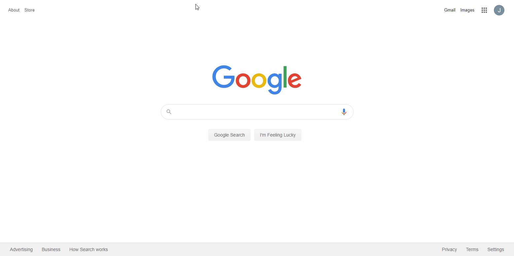
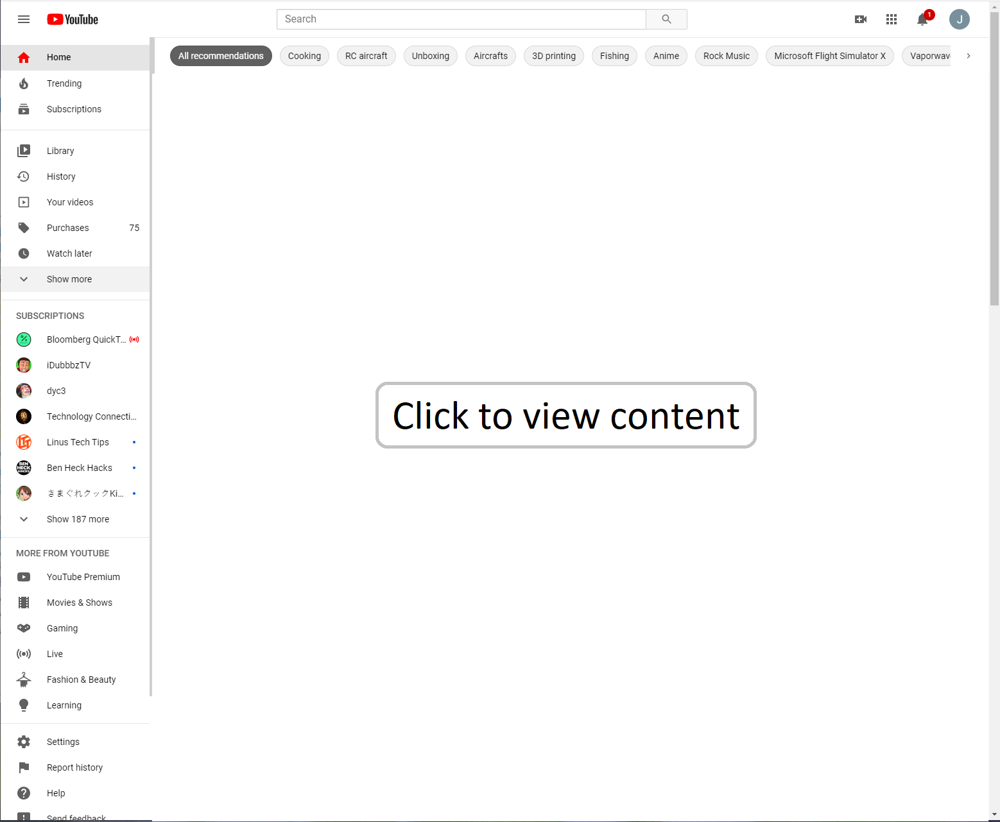
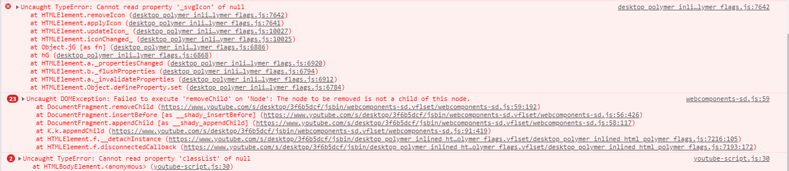

### About

The primary thing I want RIGHT NOW as I make this is a CSS injector for YouTube. Yes these exist but I would rather have my own that I trust(tin foil hat engaged).
For YouTube I want to hide the home tiles because everytime I go to YouTube with an intent to do something my mind gets hijacked by the random shit on there.
Usually I use YouTube to look up a specific video eg. music or put on some playlist.

I will add other functionality eg. adding JS/interfaces/etc... to specific websites by domain, this is not an original idea there is a pretty cool extension I briefly used that was specifically for injecting custom JS by domains. I just as I mentioned "want my own".

### How to use

This is not a packaged extension, you have to run this in developer mode. Clone this repo then in the Extensions page use `Load unpacked` and select this folder.

### How it works

As a quick `TL;DR` on how Chrome Extensions work which I'm not an expert but what I learned to make this:
* `manifest.json` is the starting point, in this case checks for YouTube url patterns
* then if a match occurs injects the custom CSS/JS code which you can trace what files it loads, that's it, no background stuff going on in this extension
* `document_start` means it runs right away, does not wait for `DOM` to load, this specifically is most important for CSS overriding so whatever gets loaded does not show its original style

### Extension functionalities

#### YouTube lander recommended tiles hiding mod

##### Disclaimer

I only tested this/intend to use it for a resolution of around/at least 1600px or so...

##### Post build/attempt actual

This shows the tiles being hidden on load, can click to show them again. Other pages eg. search don't have this class applied as the generic `primary` id exists on other pages. I may have to update the scripts `exclude_matches` array as I find other YouTube urls I use that are affected by that global CSS override.

This is what I'll have something like this, I'm hoping the injection is fast enough but usually with custom embedded stuff it's not fast enough(brief ugly white flash).

I tried a few ways to add the custom HTML, whenever it gets added the page seems to just break. Yeah seems this thing called `webcomponents-sd.js` tries to remove it.

#### See [DEVLOG](./DEVLOG.md) for more info

#### References

* https://developer.chrome.com/extensions/getstarted
* https://stackoverflow.com/questions/9515704/insert-code-into-the-page-context-using-a-content-script
* https://stackoverflow.com/questions/9263671/google-chrome-application-shortcut-how-to-auto-load-javascript/9310273#9310273